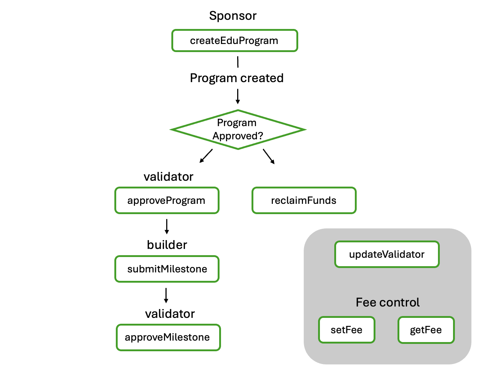

# 📚 LdEduProgram 스마트 컨트랙트

LdEduProgram 스마트 컨트랙트는 교육 프로그램을 관리하고, 제작자와 개발자 간의 보상을 투명하게 분배하는 역할을 합니다.
## 🚀 Features

- Solidity(`^0.8.20)`

## 📋 Prerequisites

- Node.js (v16 or higher)
- Npm or Yarn
- ethers.js v5
- env

## ⚙️ Installation

```bash
git clone <https://github.com/Ludium-Official/ludium-portal-contract.git>
cd ludium-portal-contract
npm install
```

**🚀 Quick Start**

```
# 프로그램 생성
node test-contract.js create

# Proposal 제출
node test-contract.js submit-proposal <programId>

# Proposal 선택
node test-contract.js evaluate <programId> <proposalId>

# 마일스톤 제출
node test-contract.js submit-milestone <programId> <milestoneId>

# 마일스톤 승인
node test-contract.js approve-milestone <programId> <milestoneId>

# 승인 (ID 지정)
node test-contract.js approve 0

# 보상 청구
node test-contract.js claim 0

# 정보 조회
node test-contract.js info 0

# 전체 흐름 테스트
node test-contract.js all
```

## 📂 Directory Structure

```

ludium-portal-contract/
├── abi/
│   └── LdEduProgram.json            # ABI 정의 파일
├── contract/
│   ├── artifacts/                   # 컴파일 정보
│   └── LdEduProgram.sol             # 메인 스마트 컨트랙트
├── .gitignore
├── package.json
├── package-lock.json
├── README.md                        # 프로젝트 설명서
└── test-contract.js                 # 테스트 및 실행 스크립트
```
## 📌 기능 개요
## 📌 기능 개요
| 기능 | 설명 |
|------|------|
| `createEduProgram` | 교육 프로그램 생성 |
| `submitProposal` | 빌더가 제안서 제출 |
| `evaluateProposal` | 벨리데이터가 제안서 선택 또는 거절 |
| `submitMilestone` | 빌더가 마일스톤 결과 제출 |
| `approveMilestone` | 벨리데이터가 마일스톤 승인 및 보상 지급 |
| `reclaimFunds` | 만료된 프로그램의 예치금 회수 |
| `updateValidator` | 벨리데이터 주소 변경 |
| `setFee / getFee` | 수수료 설정 및 조회 |

---

| Function             | Description                                                           |
|----------------------|-----------------------------------------------------------------------|
| `createEduProgram`   | Creates a new education program                                       |
| `submitProposal`     | Builder submits a project proposal with milestones                   |
| `evaluateProposal`   | Validator selects or rejects the submitted proposal                  |
| `submitMilestone`    | Builder submits the results for a milestone                          |
| `approveMilestone`   | Validator approves the milestone and sends the reward                |
| `reclaimFunds`       | Program creator reclaims funds if the program expired without approval |
| `updateValidator`    | Updates the validator address for the program                        |
| `setFee / getFee`    | Sets and retrieves platform fee in basis points                     |



## 📖 사용법

### 1 **스마트 컨트랙트 배포**
* remix
* foundry
* hardhat
* vanila javascript


### 2 **스마트 컨트랙트 배포**
```
struct EduProgram {
    uint256 id;
    string name;
    uint256 price;
    uint256 startTime;
    uint256 endTime;
    address maker;
    address validator;
    bool approve;
    bool claimed;
    address builder;
}

```


### 주요 이벤트
| 이벤트 | 설명 |
|--------|------|
| `ProgramCreated` | 프로그램 생성 시 발생 |
| `ProposalSubmitted` | 제안서 제출 시 발생 |
| `ProgramApproved` | 제안서가 선택되었을 때 발생 |
| `MilestoneSubmitted` | 마일스톤 결과 제출 시 발생 |
| `MilestoneApproved` | 마일스톤 승인 및 보상 지급 시 발생 |


### Test
```
# 프로그램 생성
node test-contract.js create

# 프로그램 승인 (ID 지정)
node test-contract.js approve 0

# 그랜츠 청구 (ID 지정)
node test-contract.js claim 0

# Proposal 제출
node test-contract.js submit-proposal <programId>

# Proposal 선택
node test-contract.js evaluate <programId> <proposalId>

# 마일스톤 제출
node test-contract.js submit-milestone <programId> <milestoneId>

# 마일스톤 승인
node test-contract.js approve-milestone <programId> <milestoneId>

# 프로그램 정보 조회 (ID 지정)
node test-contract.js info 0

# 새 프로그램 생성부터 전체 프로세스 테스트
node test-contract.js all

# 기존 프로그램으로 전체 프로세스 테스트 (ID 지정)
node test-contract.js all 0

# 도움말 표시
node test-contract.js
```

### .env
```
RPC_URL = RPC URL = Edu Chain Testnet
CHAIN_ID=656476
PRIVATE_KEY=Owner의 Private Key  
CONTRACT_ADDRESS=컨트랙트 주소

VALIDATOR_ADDRESS=벨리데이터 주소
BUILDER_ADDRESS=빌더 주소
BUILDER_PRIVATE_KEY=빌더 Private Key

```


### Result 
```
robert@aragon:~/work/ludium/ludium-portal-contract$ node test-contract.js create
📝 프로그램 생성 중...
이름: 교육 프로그램 테스트
가격: 0.01 EDU
시작: 2025. 3. 17. 오후 11:54:21
종료: 2025. 3. 18. 오전 12:54:21
벨리데이터: 0x6e759B3B147FaF2E422cDAda8FA11A17DD544f36
✅ 트랜잭션 전송됨: 0x14103440198213c5638749b6510df9213812f6eb5fce977f2b0f2c0c97b566c7
🎉 프로그램 생성 완료! 프로그램 ID: 0
robert@aragon:~/work/ludium/ludium-portal-contract$ node test-contract.js info 0

🔍 프로그램 정보 조회 중... (ID: 0)

📋 프로그램 정보:
ID: 0
이름: 교육 프로그램 테스트
가격: 0.01 EDU
시작: 2025. 3. 17. 오후 11:54:21
종료: 2025. 3. 18. 오전 12:54:21
생성자: 0x6e759B3B147FaF2E422cDAda8FA11A17DD544f36
벨리데이터: 0x6e759B3B147FaF2E422cDAda8FA11A17DD544f36
승인 여부: 미승인
청구 여부: 미청구
빌더: 없음
```

## 📐 Convention

- Naming
    - Contract: PascalCase
    - functions/variables: camelCase
- CommentStyle:
    - NatSpec :  `@notice`, `@param`
- Contract Security:
    - `nonReentrant` 사용
    - `Ownable`로 수수료 설정 등 관리자 권한 구분
    