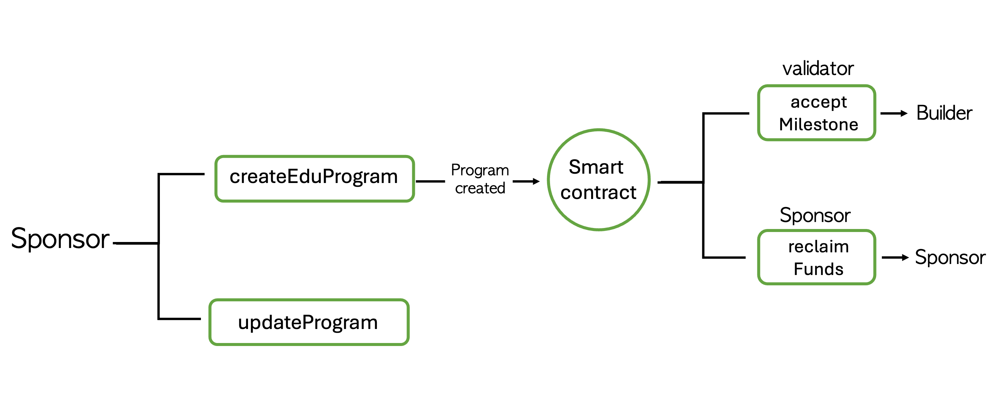

# 📚 LdEduProgram Smart Contract

The LdEduProgram smart contract manages educational programs and ensures transparent reward distribution between sponsors and developers.

## 🚀 Features

- Solidity`(^0.8.20)`

## 📋 Prerequisites

- Node.js (v16 or higher)
- Npm or Yarn
- ethers.js v5
- env


## 📖 Instructions

### ⚙️ Installation

```bash
git clone <https://github.com/Ludium-Official/ludium-portal-contract.git>
cd ludium-portal-contract
npm install
```

### **SmartContract Compile**
* remix
* foundry
* hardhat
* vanila javascript

```
hardhat
nvm use 20 
npx hardhat clean
npx hardhat compile
```

**Copy the generated ABI file to the abi folder from**
```artifacts/contracts/LdEduProgram.sol/LdEduProgram.json```


### **Deploy Smart Contract**
```
node test-contract.js deploy
```

## 📂 Directory Structure

```
ludium-portal-contract/
├── abi/
│   └── LdEduProgram.json            # ABI 
├── artifacts/                       #  Compilation 
├── contracts/
│   └── LdEduProgram.sol             # Smart Contract 
├── .gitignore
├── package.json
├── package-lock.json
├── README.md                        # Project Guide
└── test-contract.js                 # Test script
```

## 📌 Function Overview


| Function | Description |
|------|------|
| `createEduProgram` | Creates an educational program |
| `acceptMilestone` | Validator approves a milestone |
| `updateProgram` | Sponsor updates the program (reward, dates, validator) |
| `reclaimFunds` | Returns rewards to sponsor after program ends |

---


### Events
| event | description |
|------|------|
| ProgramCreated |   Emitted when a new program is created
|MilestoneAccepted |   Emitted when a validator approves a milestone
|ProgramEdited |   Emitted when a program is updated 
|FundsReclaimed |   Emitted when sponsor reclaims remaining rewards


### Test
```
# create program
node test-contract.js create

# accept milestone 
node test-contract.js accept-milestone {programId}

# reclaim funds
node test-contract.js reclaim {programId}

# update program
node test-contract.js update-program {programId}

# fetch program info 
node test-contract.js info {programId}

# help
node test-contract.js
```

### .env
```
RPC_URL = 
CHAIN_ID= 
PRIVATE_KEY=
CONTRACT_ADDRESS=
VALIDATOR_ADDRESS=
BUILDER_ADDRESS=
WEPIN_APP_ID=
WEPIN_APP_KEY=
```


### Result 
``` 
📝 reating a program...
Name: Ludium Program Test
Price: 0.01 EDU
Start: 2025. 3. 17. 오후 11:54:21
End: 2025. 3. 18. 오전 12:54:21
Validator: 0x6e759B3B147FaF2E422cDAda8FA11A17DD544f36
✅ Transaction: 0x14103440198213c5638749b6510df9213812f6eb5fce977f2b0f2c0c97b566c7
🎉 Program created! ID: 0
```
```
✅ Milestone accepted successfully
```
```
💸 Attempting to reclaim funds... (ID: ${programId})
✅ Funds reclaimed!
```
```
🛠️ Updating program...
✅ Program updated!
```
```
🔍 Fetching program info... (ID: ${programId})

📋 Program Info:
ID: 0
name: Ludium Program Test
price: 0.01 EDU
startDate: 2025. 3. 17. 오후 11:54:21
endDate: 2025. 3. 18. 오전 12:54:21
sponsor: 0x6e759B3B147FaF2E422cDAda8FA11A17DD544f36
validator: 0x6e759B3B147FaF2E422cDAda8FA11A17DD544f36
claimed : 미청구
```